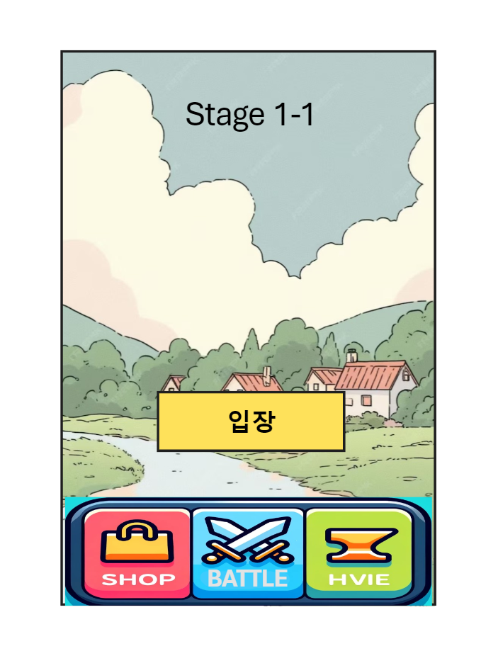

# SMART_PHONE_GAME_PROGRAMMING_TERM_PROJECT

스마트폰 게임 프로그래밍 텀 프로젝트입니다.

## :iphone:게임 간단 요약

스테이지를 클리어하여 장비와 동료를 얻고 내 영웅을 강화하는 게임입니다.

## :page_with_curl:게임 설명

버려진 아기 영웅이 성장해 나아가며 동료를 모아 보스를 처리하는 게임 입니다.

플레이어들은 아기 영웅으로 게임을 시작하게 됩니다. 

스테이지를 클리어 해 가며 재화를 얻게 되고,

얻은 재화로 음식과, 장비, 동료를 구매할 수 있습니다.

아기와 동료들을 성장시켜 나쁜 보스를 죽이세요 !!

## :notebook_with_decorative_cover: 게임 구성

* 게임 시작페이지

****

* 인게임 화면

* 내 영웅 보기 및 내 영웅 관리
* 동료 보기 및 동료 관리

 

## :calendar:개발 기간

- 시작일: 2023-04-04
- 종료일: 2023-06-05

## 개발일정

* **1주차 ( 2023-04-04 ~ 2023-04-10)**

   이미지 리소스 만들기

* **2주차  ( 2023-04-11 ~ 2023-04-17)**

  게임 시작 화면 및 Shop, Hero 버튼 구현

* **3주차  ( 2023-04-11 ~ 2023-04-17)**

  인게임 화면 및, 캐릭터 이동 버튼, 캐릭터 이동, 캐릭터 공격 구현

* **4주차  ( 2023-04-18 ~ 2023-04-24)**

  적 AI, 적 피격, 적 공격 구현

## 팀원

- 안드로이드 앱 개발자: [이종혁]
- UI 디자이너: [이종혁]